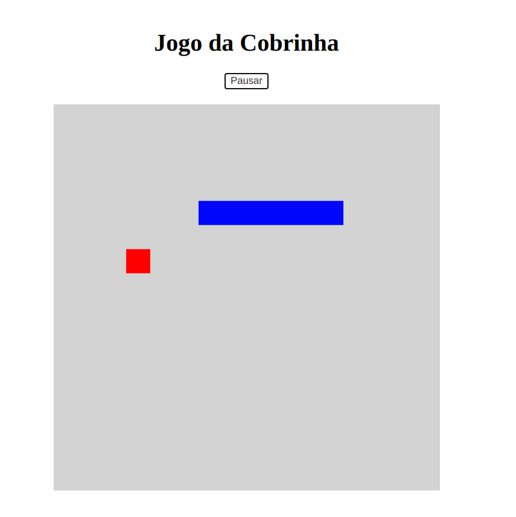

# Jogo Da Cobrinha JavaScript
Recriação do famoso jogo da cobrinha em JavaScript
Código feito durante LiveCod com a instrutora [**Gabriela Pinheiro**](https://www.linkedin.com/in/gabrielapinheiro129/) no bootcamp **WEBDeveloper** da [**Digital Innovation One**](https://digitalinnovation.one/).

### Tecnologias utilizadas:
* JavaScript;
* HTML;
* CSS;

